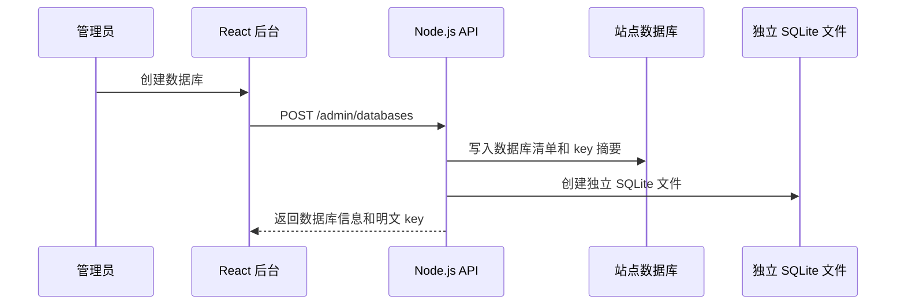
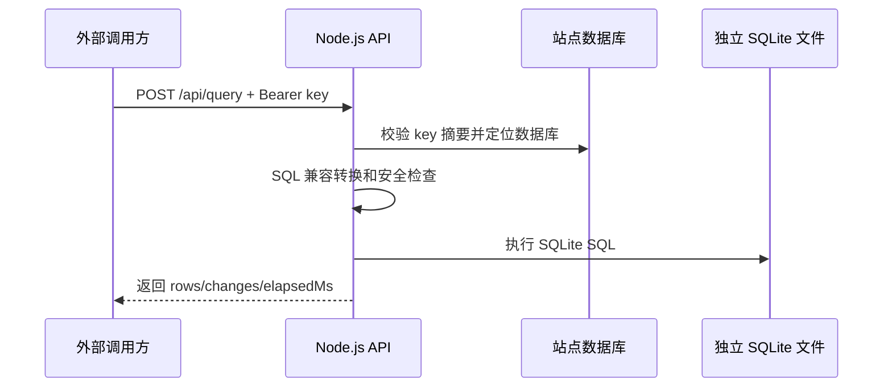

# 技术说明

## 数据边界

Lsqlite 使用两个存储区域：

- 站点数据库：保存数据库清单、key 摘要、状态、备注和审计日志。
- 数据目录：保存外部可访问的 SQLite 数据库文件，每个数据库一个独立文件。

外部 API 通过 key 映射到唯一数据库文件，不暴露站点数据库。

## 数据流

## SQL 兼容策略

服务保持 SQLite 为唯一执行引擎。兼容层只做 SQLite 能承接的轻量转换：

- 反引号标识符转双引号。
- `SERIAL`、`BIGSERIAL` 转 `integer`。
- `BOOLEAN` 转 `integer`。
- `TRUE`/`FALSE` 转 `1`/`0`。
- `NOW()`、`CURRENT_TIMESTAMP()` 转 `CURRENT_TIMESTAMP`。
- `AUTO_INCREMENT` 转 `autoincrement`。

不会模拟 SQLite 不支持的数据库能力，例如存储过程、权限 DDL、跨数据库 schema、复杂类型系统。

## 安全策略

- key 只保存 SHA-256 摘要。
- 外部 API 默认禁止跨文件和扩展加载相关语句。
- 数据库文件路径由服务生成并限制在 `DATA_DIR` 内。
- 外部 API 只根据 key 访问单个数据库文件。
- 后台通过 httpOnly cookie session 认证。

## 扩展方向

- 增加只读 key / 读写 key 分离。
- 增加限流、IP 白名单、请求审计查询页。
- 增加数据库文件备份和恢复。
- 增加 OpenAPI 描述文件。